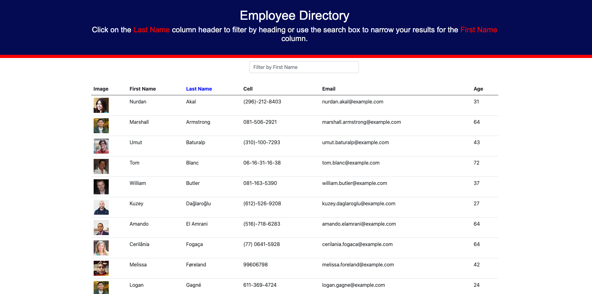
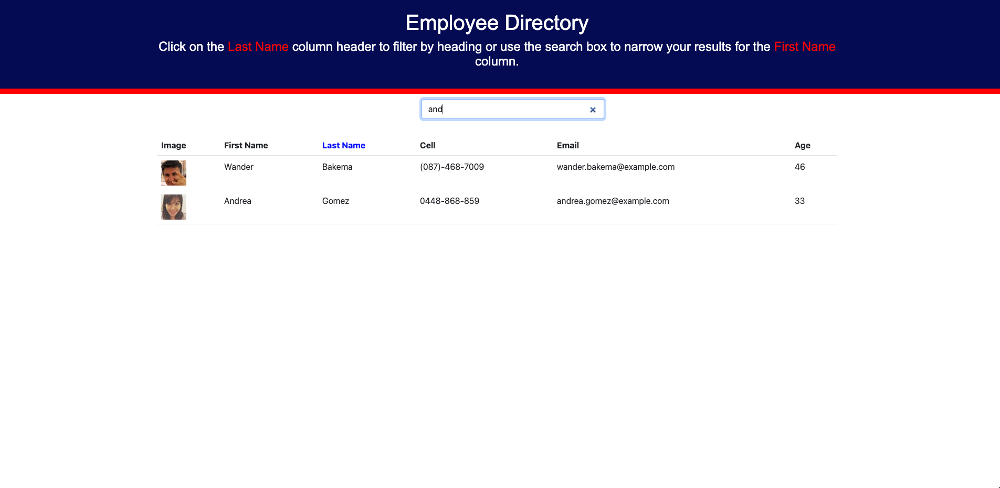

# EmployeeDirectory

David K. Brown's Employee Directory

## Table of Contents

- [Description](#description)

- [Screenshots](#screenshots)

- [Acceptance-Criteria](#Acceptance-Criteria)

- [Installation](#installation)

- [Credits](#credits)

- [Contributing](#contributing)

- [Copyright](#copyright)

## Description

The purpose of this app was to create an Employee Directory. The Employee Directory allows a user to view the entire employee directory at once so that they have quick access to their information. A manager would benefit greatly from being able to view non-sensitive data about their employees. Currently functionality to filter and sort is only provided on the First Name column.

## Screenshots





## Acceptance-Criteria

```md
Given a table of random users generated from the [Random User API](https://randomuser.me/), when the user loads the page, a table of employees should render.

The user should be able to:

- Sort the table by at least one category

- Filter the users by at least one property.
```

## Installation

To access this application you will need to visit my GitHub page and the "EmployeeDirectory" repository. After the repository is cloned/forked you can make edits to the application in your repository. Any questions should be directed to [David Brown](mailto:gatech55@gmail.com). The application repository can be found here: [EmployeeDirectory](https://github.com/GaTech55/EmployeeDirectory). The GitHub Page site can be found here: [EmployeeDirectory](https://gatech55.github.io/EmployeeDirectory/#/).

## Credits

This project was bootstrapped with [Create React App](https://github.com/facebook/create-react-app).

© 2019 Trilogy Education Services, a 2U, Inc. brand. All Rights Reserved.
[GitLab-18-Homework](https://gt.bootcampcontent.com/GT-Coding-Boot-Camp/gt-inc-fsf-pt-08-2020-u-c/tree/master/18-PWA/02-Homework)

## Contributing

| **Commits** | **Contributor** |

| 14| [GaTech55](https://github.com/GaTech55)|

## Copyright

Copyright (c) 2021 David Brown.
